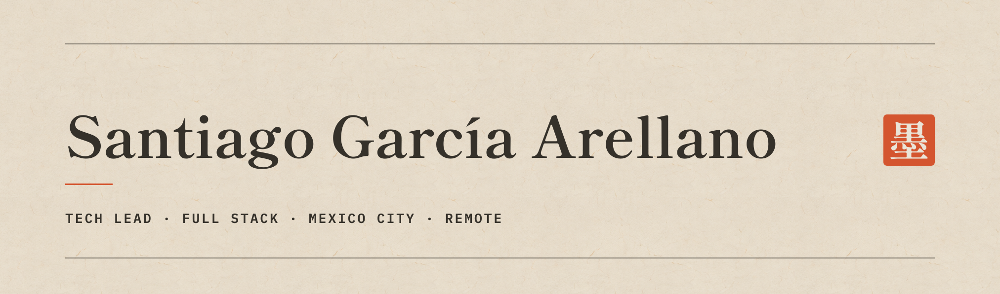

  I led four developers to ship a React Native claims app in three months, and trained eight more on a component library that four teams adopted. 
  I have also built platforms end to end on my own — architecture through support — that are still running today.

  
  

 

## / what I can take off your hands

<table>
  <tr>
    <td valign="top" width="33%">
      <strong>A PRODUCT, FROM NOTHING</strong>
        
      First sketch to a live URL: architecture, interface, API, deployment, analytics, and the support that comes after launch. One person, one thread of accountability.
    </td>
    <td valign="top" width="33%">
      <strong>A FRONTEND THAT STOPS SLOWING YOU DOWN</strong>
        
      Design systems and shared component libraries. At Sekura, a 30-component library cut interface build time by 40–50%.
    </td>
    <td valign="top" width="33%">
      <strong>A TEAM THAT SHIPS</strong>
        
      Technical leadership, code review, and the unglamorous standards that keep a codebase workable long after I step away from it.
    </td>
  </tr>
</table>

 

## / what that has looked like

<table>
  <tr>
    <td valign="top" width="33%">
      <strong>ZORYA / EVERLAY GROUP</strong>
        
      Built <code>BuzZync.Components</code> with .NET 9, Blazor, and MudBlazor. Prototyping got roughly 50% faster, four teams adopted it, and eight developers were trained on it.
    </td>
    <td valign="top" width="33%">
      <strong>SEKURA</strong>
        
      Led four developers and shipped a React Native claims application in three months. It reached 88% adoption.
    </td>
    <td valign="top" width="33%">
      <strong>XTENDOPS</strong>
        
      Worked inside a 13-person team on a full Meteor/JavaScript to SvelteKit/TypeScript migration, for a platform past 40,000 registered accounts.
    </td>
  </tr>
</table>

 

## / shipped alone, start to finish

These are the ones where there was nobody else to hand the hard part to.

<table>
  <tr>
    <td valign="top" width="28%">
      <strong><a href="https://vocesyagentes.goynmexico.org">VOCES Y AGENTES</a></strong> 
      GOYN MÉXICO
    </td>
    <td valign="top" width="72%">
      Sole developer: functional architecture, UX/UI, development, deployment, PostHog, SEO, support, and the iteration that followed. In production and still running. Visual system by Ana Victoria Ávila.
    </td>
  </tr>
  <tr>
    <td valign="top" width="28%">
      <strong><a href="https://entrevistas.sintitulo.dev">ENTREVISTAS</a></strong> 
      FREE, NO ACCOUNT REQUIRED
    </td>
    <td valign="top" width="72%">
      Spoken job-interview rehearsal. The loop runs mic to speech-to-text to an LLM interviewer to speech and back over a WebSocket, with voice-activity detection deciding when you have finished answering. Svelte 5, Fastify, Gemini, and ElevenLabs, on Cloud Run.
    </td>
  </tr>
  <tr>
    <td valign="top" width="28%">
      <strong><a href="https://ats.sintitulo.dev">TU CV CUENTA</a></strong> 
      FREE, NO ACCOUNT REQUIRED
    </td>
    <td valign="top" width="72%">
      Next.js, Vercel, PostHog, Redis, Google APIs, and Gemini Flash-Lite 3.1, with IP-based rate limits so the cost stays survivable. Built and paid for on my own.
    </td>
  </tr>
</table>

 

## / stack

<table>
  <tr>
    <td valign="top" width="50%">
      <strong>FRONTEND / UI</strong>
        
      &nbsp;
      &nbsp;
      &nbsp;
      &nbsp;
      &nbsp;
      &nbsp;
      &nbsp;
      &nbsp;
      &nbsp;
      
    </td>
    <td valign="top" width="50%">
      <strong>BACKEND / REAL-TIME</strong>
        
      &nbsp;
      &nbsp;
      &nbsp;
      &nbsp;
      &nbsp;
      &nbsp;
      &nbsp;
      <code>WEBRTC</code>
    </td>
  </tr>
  <tr>
    <td valign="top" width="50%">
      <strong>DATA / PLATFORM</strong>
        
      &nbsp;
      &nbsp;
      &nbsp;
      &nbsp;
      &nbsp;
      &nbsp;
      
    </td>
    <td valign="top" width="50%">
      <strong>QUALITY / DELIVERY</strong>
        
      &nbsp;
      &nbsp;
      &nbsp;
      &nbsp;
      &nbsp;
      
    </td>
  </tr>
</table>

  <code>SPANISH: NATIVE</code>&nbsp;&nbsp;
  <code>ENGLISH: B2 PROFESSIONAL</code>&nbsp;&nbsp;
  <code>REMOTE + SCHEDULED CDMX</code>

 

## / working together

Tell me what needs to exist and by when. If I am the wrong person for it, I will say so and point you somewhere better.

  <a href="mailto:santiago.garcia.dev@gmail.com"><strong>santiago.garcia.dev@gmail.com</strong></a>
  &nbsp;·&nbsp;
  <a href="https://www.santiagos.mx"><strong>santiagos.mx</strong></a>

 

  
<strong>There is a small surprise somewhere here</strong>

   
  

