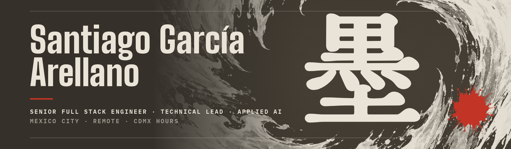

  

  I’ve led four developers to ship a claims app in 3 months, and it reached 88% adoption. 
  I’m a Senior Full Stack Engineer and Technical Lead, working primarily in C#/.NET and TypeScript; since March 2022, I’ve built RAG agents in production and now bring LLMs, voice, and security and cost controls into my own cloud-deployed products.

  
  

 

## Stack

<table>
  <tr>
    <td valign="top" width="50%">
      <strong>FRONTEND / UI</strong>
        
      &nbsp;
      &nbsp;
      &nbsp;
      &nbsp;
      &nbsp;
      &nbsp;
      &nbsp;
      &nbsp;
      &nbsp;
      &nbsp;
      
    </td>
    <td valign="top" width="50%">
      <strong>BACKEND / REAL-TIME</strong>
        
      &nbsp;
      &nbsp;
      &nbsp;
      &nbsp;
      &nbsp;
      &nbsp;
      &nbsp;
      &nbsp;
      &nbsp;
      &nbsp;
      <code>WEBRTC</code>
    </td>
  </tr>
  <tr>
    <td valign="top" width="50%">
      <strong>DATA / PLATFORM</strong>
        
      &nbsp;
      &nbsp;
      &nbsp;
      &nbsp;
      &nbsp;
      &nbsp;
      &nbsp;
      
    </td>
    <td valign="top" width="50%">
      <strong>QUALITY / DELIVERY</strong>
        
      &nbsp;
      &nbsp;
      &nbsp;
      &nbsp;
      &nbsp;
      
    </td>
  </tr>
  <tr>
    <td valign="top" colspan="2">
      <strong>APPLIED AI</strong>
        
      &nbsp;
      &nbsp;
      &nbsp;
      &nbsp;
      &nbsp;
      <code>RAG</code>&nbsp;
      <code>OPENAI</code>&nbsp;
      <code>AZURE&nbsp;OPENAI</code>&nbsp;
      <code>PINECONE</code>
    </td>
  </tr>
</table>

 

## Applied AI

<table>
  <tr>
    <td valign="top" width="28%">
      <strong>RAG AGENTS IN PRODUCTION</strong> 
      SINCE MARCH 2022
    </td>
    <td valign="top" width="72%">
      Built production customer-support RAG agents for multiple clients starting in March 2022. Configured per-client LangChain and Pinecone flows for variables, parameters, chat behavior, and document retrieval; agents surfaced real case information and linked related terms for faster resolution. Added OpenAI in 2022, then Azure OpenAI, Anthropic, and Amazon Bedrock, with Hugging Face models as fallback. Production workloads ran mainly on OpenAI and Azure OpenAI. Evaluated Mistral for European data sovereignty; never deployed.
    </td>
  </tr>
  <tr>
    <td valign="top" width="28%">
      <strong><a href="https://www.santiagos.mx/en/agent-systems">AGENT SYSTEMS</a></strong> 
      PERSONAL INFRASTRUCTURE SEE ALSO <a href="https://www.santiagos.mx/en/ai-lab">AI LAB</a>
    </td>
    <td valign="top" width="72%">
      Designed personal, nonproduction AI-assisted engineering infrastructure with roles: a read-only planner, allowlisted builders, and read-only evaluation and silent-failure gates. Required human approval for scope, data, cost, or production changes; versioned contracts and skills encode lessons from orchestration incidents. Portable memory across Codex, OpenCode, and Claude Code has an encrypted backup.
    </td>
  </tr>
</table>

 

## Experience

<table>
  <tr>
    <td valign="top" width="28%">
      <strong>ZORYA / EVERLAY GROUP</strong> 
      LEAD SOFTWARE ENGINEER JUL 2025 – PRESENT
    </td>
    <td valign="top" width="72%">
      Built full-stack features in a Blazor Web App with C#/.NET, ASP.NET Core, SQL Server, Azure, and SignalR. Designed WhatsApp Cloud API, WebRTC, and SignalR calling for browser and mobile clients; individual and call-center routing ran under 200 ms on Azure. Shipped BuzZync.Components, trained 8 developers in 3 sessions, and cut prototyping time 50%; 4 teams adopted the library.
    </td>
  </tr>
  <tr>
    <td valign="top" width="28%">
      <strong>SEKURA</strong> 
      TECH LEAD MOBILE SEP 2024 – JUL 2025 PROMOTED AFTER ABOUT 2 MONTHS
    </td>
    <td valign="top" width="72%">
      Led 4 developers from kickoff to production on a React Native claims app for Android and iOS; it shipped in 3 months and reached 88% adoption. Defined a feature-first architecture and built about 30 reusable components, reducing implementation time 40% to 50%. Added GitHub Actions gates for tests, lint, complexity checks, and technical review; manual build work fell 40%.
    </td>
  </tr>
  <tr>
    <td valign="top" width="28%">
      <strong>JUNIOR DEVELOPER / SOFTWARE ENGINEER II</strong> 
      MAR 2022 – AUG 2024
    </td>
    <td valign="top" width="72%">
      Built customer-support RAG agents. Led a private pilot for Expedia, reset scope, and shipped full stack in 1 week with SvelteKit and MongoDB while coordinating 4 international developers. Promoted to Software Engineer II within a year. Helped modernize a platform with 40,000+ registered accounts, moving interfaces, endpoints, and Express backend logic from JavaScript, jQuery, and React through Meteor to SvelteKit and TypeScript in a 13-person team. Built at least 4 of 10 full-stack hiring assessments using SvelteKit, TypeScript, NestJS, Prisma, and MongoDB.
    </td>
  </tr>
  <tr>
    <td valign="top" width="28%">
      <strong>FREELANCE</strong> 
      WEB DEVELOPER 2019 – 2022
    </td>
    <td valign="top" width="72%">
      Built paid websites with defined scopes for small businesses from 2019 to 2022; Lighthouse scores exceeded 90. Taught JavaScript and Git to more than 15 junior developers.
    </td>
  </tr>
</table>

 

## Solo projects

Solo projects built end to end, from architecture and UX/UI through deployment and continued operation.

<table>
  <tr>
    <td valign="top" width="28%">
      <strong><a href="https://vocesyagentes.goynmexico.org">VOCES Y AGENTES</a></strong> 
      REACT · VITE · TAILWIND CSS · POSTHOG
    </td>
    <td valign="top" width="72%">
      Built an institutional platform for GAJ, YouthBuild México, and GOYN México from scratch as sole developer, covering architecture, UX/UI, GitHub deployment, analytics, accessibility, technical SEO, support, and ongoing evolution. Still in production; in July 2026, it appeared among the top search results for “Voces y Agentes” without institutional search terms. Visual system by Ana Victoria Ávila.
    </td>
  </tr>
  <tr>
    <td valign="top" width="28%">
      <strong><a href="https://somos.goynmexico.org">METRO GOYN</a></strong> 
      SVELTEKIT · SVELTE 5 · TYPESCRIPT · GSAP · CSS 3D
    </td>
    <td valign="top" width="72%">
      Built Sistema de Avances Colaborativo, Metro GOYN, as sole architect and UX/UI developer; co-designed the visual system and signage with Ana Victoria Ávila. Launched at somos.goynmexico.org on September 27, 2026; the 2.5D station organizes 19 plenary responses into 4 lines. Migrated to strict TypeScript; each PR runs type checks from September 28; CSS 3D scenes use per-browser full/lite/min memory budgets.
    </td>
  </tr>
  <tr>
    <td valign="top" width="28%">
      <strong><a href="https://entrevistas.sintitulo.dev">ENTREVISTAS</a></strong> 
      SVELTE 5 · FASTIFY · GEMINI · ELEVENLABS · CLOUD RUN
    </td>
    <td valign="top" width="72%">
      Built a free, accountless interview-practice voice agent that transcribes speech, generates questions from full job postings, and responds with synthesized voice. WebSockets and interruption prevention support real-time audio; the agent closes interviews with a scored PDF report. Enforced atomic, fail-closed Upstash Redis quotas, an emergency switch, and duration and audio limits; deployed on Google Cloud Run without storing voice or reports.
    </td>
  </tr>
  <tr>
    <td valign="top" width="28%">
      <strong><a href="https://ats.sintitulo.dev">TU CV CUENTA</a></strong> 
      NEXT.JS · VERCEL · REDIS · POSTHOG
    </td>
    <td valign="top" width="72%">
      Built Tu CV Cuenta (ATS Trainer), a free, accountless serverless app that evaluates a resume against an optional job posting. Returns an ATS diagnosis, score, missing keywords, alerts, recommendations, and an editable PDF-exportable draft; adds structured outputs, deterministic server-side validation, prompt-injection defenses, temporary processing, Redis IP limits, analytics, and automated tests. Built and self-funded solo.
    </td>
  </tr>
</table>

 

## Credentials

  <code>MICROSOFT AZURE FUNDAMENTALS (AZ-900) · SEP 2026</code>&nbsp;&nbsp;
  <code>META CERTIFIED WHATSAPP FOR BUSINESS TECHNICAL IMPLEMENTATION · 2025</code>

  <code>SPANISH: NATIVE</code>&nbsp;&nbsp;
  <code>ENGLISH: C2 PROFICIENT · EF SET 74/100</code>&nbsp;&nbsp;
  <code>REMOTE + SCHEDULED CDMX</code>

 

## Contact

I’m based in Mexico City and work remotely on Mexico City time. For a role or technical conversation related to this work, send me a note.

  <a href="mailto:santiago@santiagos.mx"><strong>santiago@santiagos.mx</strong></a>
  &nbsp;·&nbsp;
  <a href="https://www.santiagos.mx"><strong>santiagos.mx</strong></a>

 

  
<strong>There is a small surprise somewhere here</strong>

   
  

